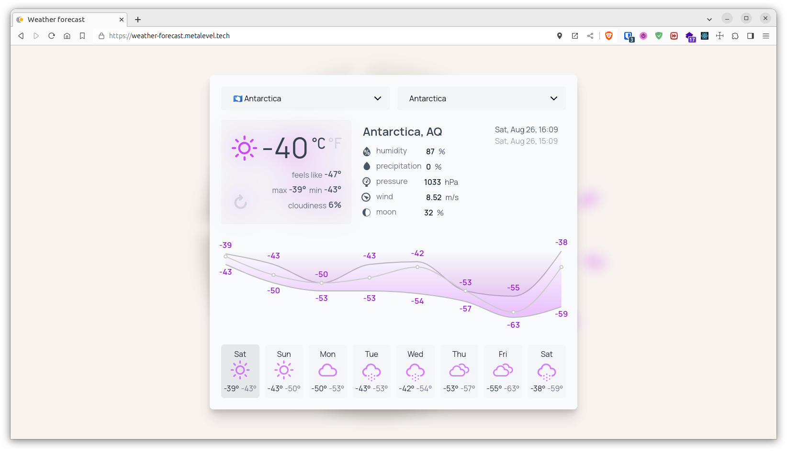
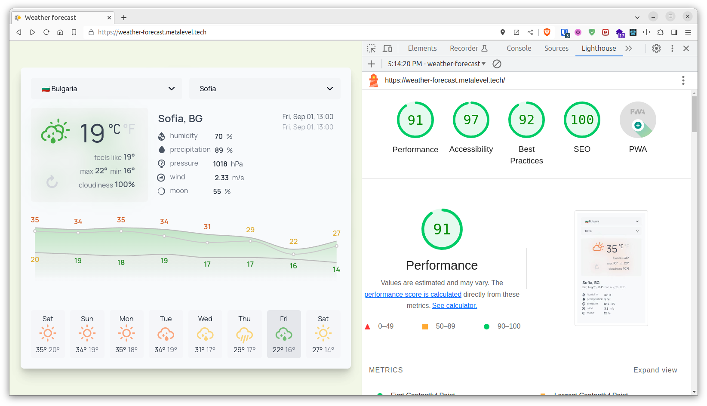

# Weather Forecast

[](https://app.codacy.com/gh/metalevel-tech/prj-nextjs-weather-forecast/dashboard?utm_source=gh&utm_medium=referral&utm_content=&utm_campaign=Badge_grade)

**The purpose of the project is to satisfy an exam task for a job interview: [assignment](.assignment/task-assignment.md). For more information about the project see the [Workflow](./.assignment/notes.md#workflow) section.**

[](https://weather-forecast.metalevel.tech/)

[](https://weather-forecast.metalevel.tech/)

## Usage statistics

- <https://vercel.com/metalevel/prj-nextjs-weather-forecast/analytics>
- <https://home.openweathermap.org/statistics/onecall_30>

## Credits

This is a [Next.js](https://nextjs.org/) project bootstrapped with [`create-next-app`](https://github.com/vercel/next.js/tree/canary/packages/create-next-app) and hosted on [Vercel](https://vercel.com/).

The Country/State/City data is taken from [venkatmcajj/react-country-state-city](https://github.com/venkatmcajj/react-country-state-city).

Also the code of the [`<SelectDropdown />`](components/SelectDropdown.tsx) component and of the [`geo-type.ts`](types/geo-types.ts) file is particularly based on the code of the analogus component in [venkatmcajj/react-country-state-city](https://github.com/venkatmcajj/react-country-state-city). Here is an improved and TailwindCSS adapted version of the mentioned code.

Here I'm using the [**"Weather Icons"**](https://github.com/erikflowers/weather-icons/tree/master) pack which is licensed licensed under [SIL OFL 1.1](https://scripts.sil.org/cms/scripts/page.php?site_id=nrsi&id=OFL).

## Getting Started Dev

Install the dependencies:

```bash
npm install
```

Checkout the [`.env.example`](.env.example) file and create a `.env.local` file with an actual value of `OPEN_WEATHER_API_KEY`. I'm using [One Call API 3.0](https://openweathermap.org/api/one-call-3) with subscription of the base plan.

In addition you may want to create a Vercel project and link it to the repository then you can manage the environment variables from the Vercel admin panel.

Run the development server:

```bash
npm run dev
```

Open [http://localhost:3000](http://localhost:3000) with your browser to see the result.
